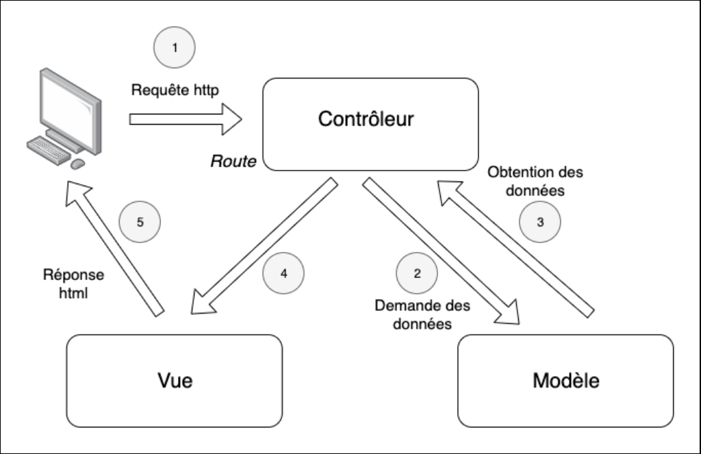

# 11-mvc-pdo_sym_c2

## Connexion PDO

## Structure MVC

### Choix des dossiers

- `public` accessible à tous, contient un `controller` (frontal)
- `datas` contient juste des données
- `model` lien avec les données
- `view` contient les vues
- `controller` font les liens avec les modèles et les vues